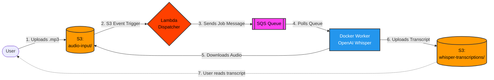

# Local AWS Async Transcription with OpenAI Whisper 🎙️

A fully local, event-driven, async audio transcription pipeline. This project emulates a cloud-native AWS architecture entirely on your local machine using **LocalStack** and **Docker**, transcribing audio files using **OpenAI's Whisper AI model** (with GPU acceleration support).

Perfect for testing, learning about AWS event-driven architectures, or transcribing sensitive audio offline without paying cloud fees!

---

## 🏗️ Architecture Overview

The pipeline mimics a standard AWS decoupled architecture. When you drop an audio file into a specific bucket, it automatically triggers a workflow that transcribes the audio and saves the text back to the cloud.



### What does each service do?

1. **LocalStack (AWS Emulator)**: Runs locally in Docker and provides mock AWS services so we don't have to pay for the real cloud during development.
2. **Amazon S3 (Simple Storage Service)**: Our "Input Tray" and "Output Box". We upload `.mp3` files here, and retrieve our `.txt` transcripts from here.
3. **AWS Lambda (Dispatcher)**: A lightweight, serverless function. It acts as a bridge. S3 tells Lambda "Hey, a new file arrived!", and Lambda immediately writes a message to SQS saying "Transcribe this file". 
4. **Amazon SQS (Simple Queue Service)**: The waiting line. If you upload 100 audio files at once, the queue holds the 100 jobs safely until the worker is ready, preventing the system from crashing under load.
5. **Worker (Python / OpenAI Whisper)**: A continuously running Docker container. It pulls jobs from the SQS queue one by one, downloads the audio, uses your GPU to run AI transcription, and uploads the final text file back to S3.

---

## 🚀 Prerequisites

To run this project locally, you will need:
* **Docker Desktop**: To run LocalStack and the Worker container.
* **Python 3.9+**: To run the initialization script.
* **AWS CLI**: To upload and download files (can be installed via Python).
* *(Optional but recommended)* **NVIDIA GPU**: Docker Desktop should be configured with WSL2 to allow GPU passthrough for significantly faster transcription.

---

## 🛠️ Setup Guide

### 1. Start the Docker Environment
First, we will spin up the LocalStack emulator and the Whisper Worker container.

```bash
# Start the containers in detached mode
docker-compose up --build -d

# You can watch the worker's logs as it downloads the AI model
docker logs -f whisper-worker
```

### 2. Initialize the AWS Infrastructure
Because LocalStack starts empty, we need to create our S3 buckets, SQS queue, and deploy our Lambda function into it.

```bash
# Navigate to the terraform directory
cd terraform

# Run the python initialization script (requires boto3)
pip install boto3
python init_localstack.py
```
*Wait for the script to say "Setup completed successfully!"*

### 3. Install AWS CLI for Testing
We need a way to upload files to our local bucket. You can install the AWS CLI using Python:

```bash
pip install awscli
```

Because the CLI normally tries to talk to real AWS, we need to give it some fake credentials for our local environment. Run these in your terminal (PowerShell example):
```powershell
$env:AWS_ACCESS_KEY_ID="test"
$env:AWS_SECRET_ACCESS_KEY="test"
$env:AWS_DEFAULT_REGION="us-east-1"
```
*(For Mac/Linux, use `export` instead of `$env:`)*

---

## 🧪 Testing the Pipeline

Now for the fun part. Let's trigger the event-driven architecture!

### Upload an Audio File
Use the AWS CLI to upload an audio file to the LocalStack S3 bucket. Notice how we use `--endpoint-url` to point the CLI to our local emulator instead of the real cloud.

```bash
aws --endpoint-url=http://localhost:4566 s3 cp my-audio-file.mp3 s3://audio-transcription-bucket-v2/audio-input/
```

### Watch the Magic Happen
As soon as the upload finishes, S3 triggers Lambda, which sends a message to SQS. Check your worker logs to see it grab the job and transcribe it!

```bash
docker logs -f whisper-worker
```

### Retrieve the Transcript
Once the worker log says "Processing completed successfully", download your transcript from S3:

```bash
aws --endpoint-url=http://localhost:4566 s3 cp s3://audio-transcription-bucket-v2/whisper-transcriptions/my-audio-file.mp3.txt .
```

Open the `.txt` file and read your AI-generated transcription! 🎉

---

## ⚙️ Customization

### Changing the Whisper Model Size
By default, this project uses the `medium` Whisper model, which offers a great balance of accuracy and speed. If you have less VRAM, or want even higher accuracy, you can change the model.

In `docker-compose.yml`, change the `WHISPER_MODEL` environment variable:
```yaml
environment:
  - WHISPER_MODEL=base  # Options: tiny, base, small, medium, large
```
Then run `docker-compose up -d` to restart the worker with the new model.
